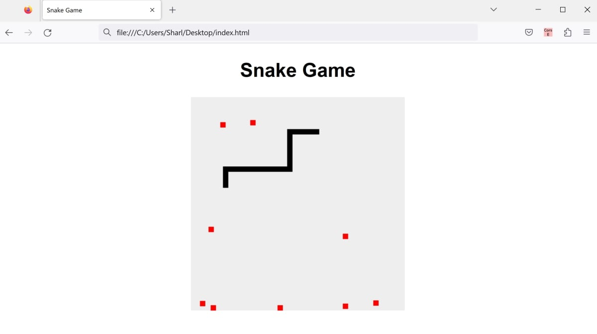

# snake-game-html-css-js
This is an example project on how to create the classic snake game using HTML, CSS, and JavaScript 

The project consists of:
* index.html - Simple HTML page to open in a browser
* styles.css - Styling for the HTML page.
* script.js - Functionality for the snake game.

## To Run

* Click on the index.html file to open it in a web browser. Play the game by using the right, left, up or down arrows to move the snake and collect the food.

## Example

